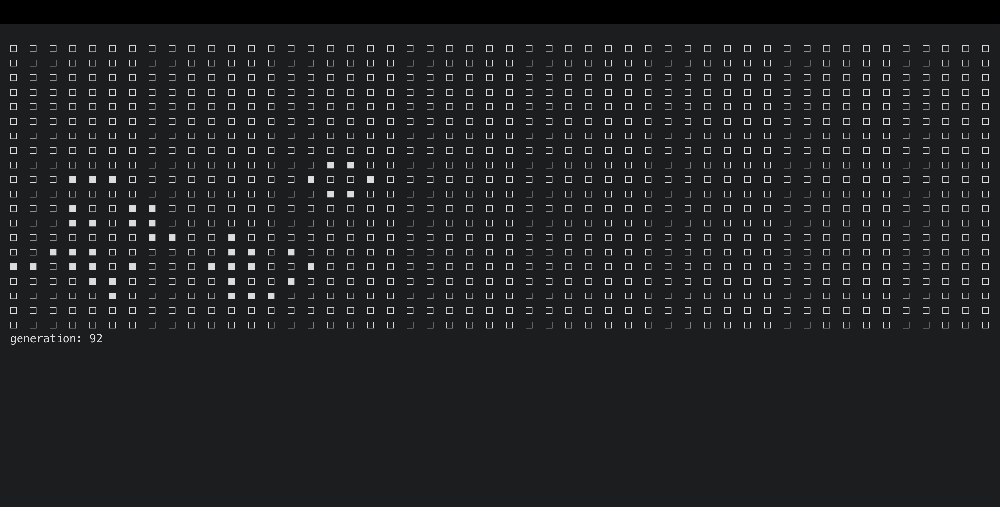

# Conway's Game of Life - C implementation
> petit projet pour expérimenter avec le langage.

---

## Fonctionnalités
- [Jeu de la vie (Wikipedia)](https://en.wikipedia.org/wiki/Conway%27s_Game_of_Life)  
- Affichage dans le terminal  
- Boucle infinie simple avec générations qui évoluent  

---

## 09/24/2025



- Première version fonctionnelle  
- Game loop de base qui fonctionne sous ces règles :  
  - Toute cellule vivante avec **moins de deux voisins vivants** meurt (sous-population).  
  - Toute cellule vivante avec **deux ou trois voisins vivants** survit.  
  - Toute cellule vivante avec **plus de trois voisins vivants** meurt (surpopulation).  
  - Toute cellule morte avec **exactement trois voisins vivants** devient vivante (reproduction).  

---

## Utilisation
Compiler avec `gcc` :

```bash
gcc main.c -o game
```
Lancer :
```bash
./game
```
